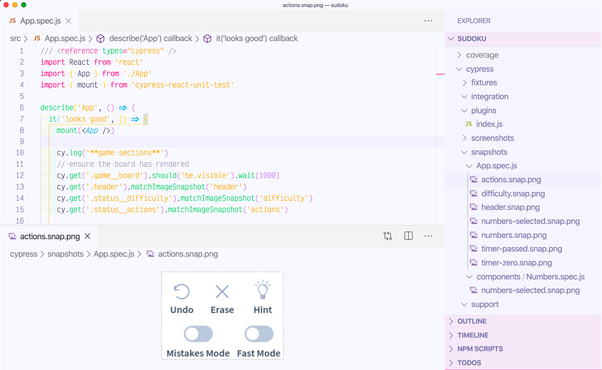

# sudoku 

Sudoku game forked from [raravi/sudoku](https://github.com/raravi/sudoku).

This fork is showing how to test game's components using Cypress, [cypress-react-unit-test](https://github.com/bahmutov/cypress-react-unit-test), and the open source visual image diffing plugin [cypress-image-snapshot](https://github.com/palmerhq/cypress-image-snapshot).

## Videos

Watch the entire free series of videos explaining visual testing step-by-step in the playlist [Visually testing React component using open source tools](https://www.youtube.com/playlist?list=PLP9o9QNnQuAYhotnIDEUQNXuvXL7ZmlyZ).

- [Writing first React component test](https://youtu.be/RqdXukwIdj0)
- [Visual testing for Numbers element](https://youtu.be/hDTYBiKJBAY)
- [Visual test for selected number](https://youtu.be/5NuLQgdk-rU)
- [Testing static sections of the game](https://youtu.be/D-u_ojVTgqQ)
- [Testing timer display by controlling the application's clock](https://youtu.be/qQikRD_ygug)
- [Update image snapshots](https://youtu.be/sd4MFgEUfPs)
- [Style Numbers component](https://youtu.be/9hkyUhllTSw)
- [Click event test for Numbers component](https://youtu.be/F1FC4hZpAX4)
- [Mocking value passed via Context Provider](https://youtu.be/wvJgKz46a8A)
- [Storing snapshot images](https://youtu.be/C_XVcftt14A)
- [Running image tests on CI](https://youtu.be/gngLg1_J-9Q)
- [Use image tolerance value when comparing image snapshots](https://youtu.be/hTukgIQh81w)
- [using a local Docker container to generate local snapshots](https://youtu.be/1XQbGtRITys)
- [Running the same Docker container locally and on CI](https://youtu.be/FcoHSjrhXo4)

Still to record:

- skipping snapshots in the interactive mode
- making a pull request commit check for visual results
- visual testing for the random Sudoku board itself
- ignoring parts of the image during comparison
